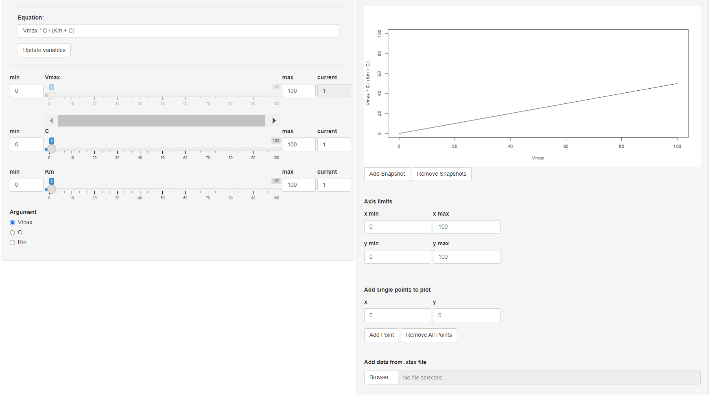

# esqlabsR.FunctionVisualiser

<!-- badges: start -->
<!-- badges: end -->

The Dynamic Equation Visualizer

## Installation

You can install the development version of `esqlabsR.FunctionVisualiser` from [GitHub](https://github.com/) with:

``` r
install.packages("remotes")
remotes::install_github("esqLABS/esqlabsR.FunctionVisualizer")
```

## Usage

Launch visualiser:

``` r
library(esqlabsR.FunctionVisualiser)
esqlabsR.FunctionVisualiser::run_app()
```

```{r, echo=FALSE, out.width='100%', fig.align='center'}

```
